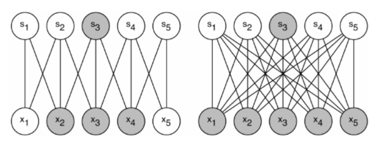

# Going deeper with convolutions

# Abstract

---

- 이 논문은 ILSVRC14에서 detection과 classification task에 대한 최신 기술 Inception이라는 deep CNN 아키텍쳐를 제안합니다.(ILSVRC14에 사용된 것은 GoogLeNet이라는 22계층의 네트워크가 사용되었습니다.)
- 이 Network는 계산적인 부분을 유지시키고, 깊이와 폭을 증가시키도록 세심하게 디자인 되었습니다.

## Introduction

---

- CNN의 발전으로 이미지 인식, 객체 탐지 분야가 크게 발전을 했습니다. 이러한 발전은 하드웨어와 더 큰 데이터셋 및 모델 뿐만 아니라 새로운 아이디어, 알고리즘의 결과라는 것입니다.
- 이 논문은 Inception 이라는 효율적인 Deep Neural Network Architecture에 집중할 것입니다.
    - “Deep” 이라는 용어가 2가지의 의미를 가지게 될 것입니다.
        1. “Inception module”이라는 형태에서 새로운 수준의 조직을 도입한다는 의미
        2. 직접적인 의미로 Network의 depth가 증가하는 의미
- 이러한 Architecture는 당시 최신 기술보다 뛰어나며, ILSVRC 2014 classification과 detection challenges에서 검증되었습니다.

## Related Work

---

- LeNet-5를 시작으로, Convolution layer(normalization또는 max-pooling이 추가) 다음 Fully-connected layer가 오는 표준 구조를 가지게 되었습니다.
    - ImageNet과 같은 더 큰 데이터셋에 대해, trend는 layer의 수와 size를 늘리면서 dropout을 사용하여 Overfitting을 해결하는 것이었습니다.
- neuroscience에 영감을 받은 model은 다양한 scale을 다루기 위해 다양한 size의 fixed Gabor filter를 사용합니다.
  (Garbor filter : 외곽선 검출하는 필터)
    - Inception model은 위 fixed 2-layer deep model과 달리 모든 filter가 학습됩니다.
    - GoogLeNet이라는 모델은 위 Inception module이 여러개 반복되어 22개층을 가지고 있습니다.
- Network-in-Network는 neural network의 표현성을 증가시키기 위해 제안된 방법입니다.
    - 이 model은 convolution layer를 적용할 때, 1x1 convolution을 추가하며 linear activation이 따르게 됩니다.
    - 이 논문에서는 두 가지의 목적으로 위의 방식을 이용했습니다.
        - network의 크기를 제한하는 계산 병복 현상을 제거하기 위해, 차원 축소의 목적으로 사용됩니다.
        - 성능 저하없이 depth뿐만 아니라 width도 증가시킬 수 있습니다.
- 당시 Object Detection에 대해 leading approach는 R-CNN입니다.
    - 이는 2-stage 접근법을 가지는데, 이 논문은  multi-box prediction, ensemble과 같은 개선사항들을 찾았습니다.

## Motivation and High Level Considerations

---

Deep neural network에서 성능을 향상시키는 가장 직관적인 방법은 size(depth와 width)를 늘리는 것입니다. 하지만 이는 두 가지 단점을 가지고 있습니다.

- size가 증가하면 parameter의 수도 증가하게 됩니다. 이때 학습 데이터의 수가 적으면 Overfitting이 쉽게 발생합니다.
- 컴퓨팅 자원의 사용이 증가합니다.(필터의 수가 늘어나면, 연산량이 quadratic하게 증가)
→ 컴퓨터 자원은 한정적이므로 네트워크의 크기를 늘리는 것보다 자원을 효율적으로 분배하는 것이 중요합니다.

위의 두 문제를 해결하기 위한 방법으로 dense한 Fully Connected 구조에서 Sparsely Connected 구조로 바꾸는 것입니다.

                                                         왼쪽-Sparse, 오른쪽-Dense

dataset의 분배 확률을 Sparse하면서 더 큰 deep neural network로 표현이 가능하면, input layer에서 output layer로 가는 layer 간의 관계를 통계적으로 분석해, 연관 관계가 높은 것들만 연결하여 최적의 Sparse한 network를 만들 수 있는 것입니다.(Dropout과 유사한 효과를 내어 Overfitting을 방지)

하지만, 오늘날의 컴퓨팅 환경은 Sparse한 data 구조에 비효율적입니다. Dense data에 대해서는 꾸준히 개선되고 고도로 수정된 수치적인 라이브러리와 CPU, GPU의 사용으로 빠른 연산이 가능했습니다. 그에 반해, Sparse data에 대한 발전은 미미했습니다.

초기에는 대칭성을 깨기 위해 CNN에 Sparse Connection을 적용했지만, 병렬 컴퓨팅에 더 최적화하기 위해 다시 Full Connection으로 바뀌었습니다. 뿐만아니라, 균일한 모델의 구조와 많은 필터들, 더 큰 배치 사이즈는 효율적인 Dense 연산이 가능하게 하였습니다.

이때, Sparse Matrix 연산을 다루는 많은 문헌에서 Sparse Matrix를 Clustering 하여 상대적으로 Dense한 submaxtix를 만드는 것을 제안하였고, 좋은 성능을 보였다고 합니다.

이로인해, Inception 구조는 유사 Sparse 구조를 시험하기 위해 시작되었습니다. 그리고 learning rate와 Hyperparameter를 조정하며, 훈련 방법을 개선하여 Localization 및 Object Detection 분야에서 특히 좋은 성능을 보였다고 합니다.

## Architectural Details

---

Inception 구조의 main idea는 **CNN에서 각 요소를 Local sparse structure를 근사화하고, 이를 dense component로 바꾸는 방법을 찾는 것**입니다. 즉, 최적의 local 구성 요소를 찾고 이를 공간적으로 반복하는 것입니다. 

→ Sparse Matrix를 Clustering 하여 상대적으로 Dense한 Submatrix를 만드는 것입니다.

이때, 이전 layer의 각 unit은 input 이미지의 특정 부분에 해당한다고 가정합니다. Input 이미지와 가까운(lower layer)에서는 local region에 Correlated Unit들이 집중되어 있습니다. 이것은 single region에 많은 Cluster들이 집중하는 뜻으로 다음 layer에서 1x1 Convolution으로 해결합니다.

하지만 더 넓은 영역의 Convolution filter가 있어야 Correlated unit의 비율을 높일 수 있는 상황이 있을 수 있습니다. 따라서 feature map을 효과적으로 추출할 수 있도록 1x1, 3x3, 5x5 convoution 연산을 병렬적으로 수행합니다. 또한 CNN에서 Pooling layer는 필수적으로 각 stage 마다 pooling을 추가합니다.

higher layer에서만 얻을 수 있는 높은 추상적인 특징이 있다는 것은 공적인 집중도가 감수하는 것을 의미합니다. 그래서 higher layer로 갈수록(깊이가 깊어질 수록) 3x3, 5x5 Convolution filter의 수도 늘어나야 합니다.

하지만 여기서 하나의 큰 문제가 발생합니다. 3x3, 5x5 Convolution filter의 수가 많아지면 연산량이 많아진다는 것입니다.

이 문제를 해결하기 위해 1x1 Convolution filter를 사용해 차원 축소를 하였습니다. 3x3, 5x5 이전에 1x1으로 먼저 차원 축소를 하여, 연산량을 줄일 수 있습니다.

추가적으로 Convolution 연산 이후 추가되는 ReLU를 통해 비선형성을 높일 수 있습니다.

또한, 효율적인 메모리 사용을 위해 낮은 layer에서는 기본적인 CNN 모델을 사용하고, 높은 layer에서는 Inception module을 사용하는 것이 좋다고 합니다.

이러한 Inception module을 사용하면 두 가지의 효과가 있습니다.

1. 과도한 연산량 문제없이 각 단계에서 유닛 수를 상당히 증가시킬 수 있습니다.
(차원 축소를 통해 다음 layer의 input을 조절 할 수 있기 떄문)
2. Visual 정보가 다양한 Scale로 처리되고, 다음 layer는 동시에 서로 다른 layer에서 특징을 추출할 수 있습니다. 1x1, 3x3, 5x5 convolution으로 다양한 특징을 추출하는 것이 가능합니다.

# 5. GoogLeNet

7개 모델의 앙상블에서 6개는 Sample 방법만 다르게한, 완전히 동일한 모델을 사용하였습니다.

위 처럼 Input → output 과정에서 DepthConcat 을 하여 나온것으로 보입니다.

[12] 는 GAP(Global Average Pooling)을 처음 사용한 논문 입니다. 해당 논문의 간략한 요약입니다.

1. FC Layer를 GAP 교체하면 Conv layer의 feature map과 Class Category 가 직접적으로 연관지어 지기 때문에 해석이 용이하다. (저자는 FC layer의 Black Box의 역할을 줄인다고 합니다.)
2. FC Layer는 너무 많은 파라미터로 Overfitting이 일어날 확률이 높기 때문에 Dropout의 의존도가 굉장히 높다, 하지만 GAP는 따로 파라미터를 가지는 값이 아니기 때문에 Overfitting의 가능성을 줄일수있다.
3. GAP는 feature map의 값을 평균내기 때문에 공간정보 변형(Spartial translation)에 Robust하다.

따라서 GAP를 사용하여 FC layer를 사용했을때 보다 top-1 acc에서 0.6% 향상 했지만 여전히 Dropout은 필요했다고 합니다.

저자는 깊게 쌓은 모델에서 그레디언트를 전파에서 나타나는 문제를 고민했습니다.

특히 네트워크의 중간layer에서 생성되는 feature들은 매우 차별적이라고 합니다.

이에 중간 layer에서 auxiliary classifier를 두어 역전파를 받을 수 있도록 하였습니다. 이때 Loss는 0.3의 가중치를 받습니다.

Predict 과정에서는 해당 분류기는 제외됩니다.

---

## 6. Training Methodology

- DistBelief의 Model parallelism, Data-parallelism을 훈련에 이용하였습니다. 이는 GoogLeNet이 CPU만을 가지고 학습을 하는데 이때, CPU로 효과적인 학습을 하는 방법에 대한 내용입니다.
- Optimizer는 Momentum을 사용했습니다.
- Learning rate schedule을 사용했습니다.
- Polyak averaging 앙상블 모델을 학습하는 방법중 하나입니다.  Predict, 추론과정에서 모델의 파라미터 backprogation에서 얻은 값의 일부를 Pred값에 적용하는 방법이라고 합니다. 지금은 전혀 사용하지 않습니다.

- 대회를 하는 긴 시간동안 다양한 Sampling 방법이 시도되었고 딱 하나의 효과적인 방법이 있다고 말하기 가 힘들다고 합니다.
- ([Some Improvements on Deep Convolutional  Neural Network Based Image Classification)](https://arxiv.org/ftp/arxiv/papers/1312/1312.5402.pdf)(다양한 크기의 이미지를 Crop후 일정한 크기로 resize 하는 방법 이라고 생각합니다. - Jittering 효과) 논문에서 영감을 받아 모델별(이해 하기로는 앙상블 모델요소? 혹은 )로 다른 크기의 이미지를 입력이미지로 주는 것이 효과가 있었다고 합니다.
- 이미지의 전체 크기의 랜덤(8~100%)으로 자르고, 종횡비 랜덤(3/4 ~ 4/3)사이로 추출하는 방법이 효과적이 였다고 합니다.
- 위에서 언급된 같은 논문에서 사용된 방법 중 Photometric distortions(Random contrast, brightness, color) 증강이 Overfitting을 막는데 도움이 되었다고 합니다.
- Resize를 하는 과정에서 interpolation 하는 방법을 여러 방법으로 사용했지만 이게 도움이 된지는 모르겠다고 합니다.

---

## 7. ILSVRC 2014 Classification Challenge Setup and Results

해당 단락 이후부터 참가했던 ILSVRC의 Classification, Detection Challenge에 대해서 이야기합니다. 하지만 굉장히 지엽적인 실험적 결과이기 때문에 내용을 제외합니다.

- ILSVRC 2014 Classification 데이터셋은
    1. Train image : 120만장
    2. Valid image : 5만장
    3. Test image : 10만장
    4. Class 개수 : 1000개
- 두 가지의 지표
    1. Top-1 Accuracy
    2. Top-5 error rate : 상위 5개의 error의 합(이때 True label 값이 상위 5개의 Pred label안에 있으면 맞은걸로 칩니다)
    

---

## 8. ILSVRC 2014 Detection Challenge Setup and Results

ILSVRC 2014 Detection 대회는

- 200개의 Class
- BBox와 Class를 모두 맞춰야 정답으로 인정
- 최소 IOU(Jaccard index)50 이상
- 틀린 감지는 패널티
- 결과는 mAP로 집계

---

## 9. Conclusions

Inception module은 Sparse 구조를 Dense 구조로 근사화하는 것이 실현가능함을 보여줍니다. 이러한 방법의 주요한 장점은 성능은 엄청나게 상승하지만 연산량은 약간만 증가한다는 것이다.