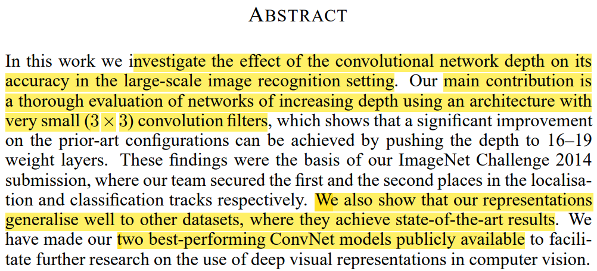

# Very deep convolutional networks for large-scale image recognition

# 0. ABSTRACT

- Large-scale의 이미지 인식 설정에서 CNN 의 깊이가 정확도에 미치는 영향을 조사합니다.
- Main contribution은 아주 작은 (3x3) Conv 필터로 만든 아키텍쳐를 사용하여 깊이 증가에 따른 평가를 시행합니다.
- 또한 다른 데이터 세트로의 일반화를 잘합니다.
- 후속 연구를 위해 가장 뛰어난 ConvNet 모델 두개를 공개합니다.

# 1. INTRODUCTION

ConvNet은 하드웨어의 발전과 더불에 최근 큰 성공을 거두고 있다.

특히 ImageNet challenge가 테스트베드 역할을 해주고 있습니다.

1. first layer에서 더 작은 window size, stride 

1. 여러 scale 을 가지는 것 → Depth의 중요함

# 2. ConvNet Configuraitons

## 2.1 Archiecture

Input image size : 224X224

Preprocessing : RGB, 각 채널의 평균값을 픽셀에서 빼는 

3X3 Conv filter를 가진 Conv layer 들을 통과합니다.

1X1 Conv filter를 채널의 변환을 위해 사용합니다.(비선형 포함)

Conv filter의 stride는 모두 1로 고정하고 해상도가 보존 되도록 padding합니다.

즉 3X3 Conv, 1 stride, 1padding 입니다.

몇개의 Conv 뒤에 나오는 5개의 max pooling 을 통해 해상도를 줄입니다.

Pooling layer는 2x2, 2 stirde로 수행합니다.

Conv 다음에는 3개의 FC layer가 있습니다.

앞 2개는 각 4096개 마지막은 predict class의 개수 1000개의 채널을 가집니다.

마지막 layer는 soft-max레이어 입니다.

모든 hidden layer는 비선형성을 위해 ReLU 정류를 가집니다.

기본적으로 LRN을 사용하지 않습니다.

## 2.2 Configurations

채널의 수는 64 → 512 

큰 깊이에도 불고하고 모델의 weights수가 작다.

## 2.3 Discussion

1. *Con*v filter로 11x11 size, stride 4 또는 7x7 size, stride 2 와 달리 모든 conv에서 3x3을 사용합니다. pooling을 거치지 않은 두개의 3x3 conv filter는 5x5 크기의 receptive field를 가지고 3개는 7x7크기를 가집니다.
    1. 이를 통해 하나의 레이어가 3개의  non-linear rectification layers를 가집니다. → (여러 scale을 봄으로서 각 scale에서의 decision을 다르게 가져갈 수 있다)
    2. 매개변수의 수를 줄일 수 있습니다. 3x3 conv filter가 3개 일 때 weights수는 $3(3^2 C^2) = 27C^2$  이지만 7x7 conv filter를 1개 사용할 때는 $7^2C^2 = 49C^2$ 가 됩니다.
    

1. C 모델에서 나타나는 1x1 Conv은 해상도의 변화없이 비선형성을 증가시키는 방법입니다. 

# 3. Classification Framework

## 3.1 Training

- Optimizer는 momentum을 사용했습니다.
- 배치 크기는 256, momentum은 0.9
- L2 Regularization 의 $5*10e^{-4}$ , 1, 2번째 FC layer에 0.5 dropout
- learning rate는 $10^{-2}$를 시작으로 valid ds를 monitor하여 1/10 으로 감소
- 최종으로는 learning rate는 $10^{-5}$ , 74 epochs 까지 학습을 수행

우리는 AlexNet에 비해 더 많은 매개변수와 더 깊은 Network에도 불구하고 수렴하는 데 저 적은 에포크가 필요한 이유로 더 작은 Conv filter와 특정 레이어의 init 때문이라고 생각한다.

- Net A를 init을 위해 사전학습하여 앞 4개의 Conv layer, 마지막 3개의 FC layer의 weights로 초기화 한다. 나머지는 random init
- random init은 평균0, 분산 $10^{-2}$ 에서 샘플링 합니다. ( 논문 제출 직후에 Xavier init을 알았다고 합니다.)
- 224x224 이미지를 얻기위해 random crop을 사용
- random horizontal flip, random RGB shift 의 Augmentation 을 사용

### 3.2 Training image size

VGG를 training 할 때 image size를 맞춰야 합니다. 여기서 적용된 것은 isotropically-rescaled training image, 즉 aspect ratio 를 살려 이미지의 해상도를 변경합니다. 이때 길이가 작은변의 값을 $S$ 로 설정하게 됩니다. 그 다음 이미지의 크기(224x224)로 crop하여 사용 하는 것입니다.

가령 (512x1024) 크기의 이미지를 $S=256$으로 변경하면 (256x512)의 크기로 $S=384$ 으로 변경하면 (384,786) 크기의 이미지가 됩니다. 이렇게 변경한 다음 (224x224)로 random crop하여 진행합니다.

$S$를 설정하는 방법은 2가지가 있습니다.

1. Single-scale training 

S의 크기를 256, 384로 고정하여 training 합니다. 이때 학습의 가속을 위해 $S=256$ 모델을 학습한 다음 가중치를 상속받아 $S=384$ 모델을 학습합니다.

이때 $S=384$에서는 $LR=10^{-3}$ 으로 학습합니다.

1. Multi-scale training

S의 크기를 [256~512]중 random하게 받아 사용합니다.

이 방법으로 더 다양한 Scale의 image를 학습합니다. 

학습의 속도를 위해 모든 multi-scale model은 single-scale model의 $S=384$ 의 가중치를 상속받아 시작합니다.

## 3.3 Testing

VGG는 train과 test의 작동방식이 다릅니다. 특히 여기서 말하는 Test data가 valid data와 같이 작동합니다.

이때 test(valid) image의 크기를 $Q$ 라고 할때 이때 $S$ 마다 $Q$ 의 크기를 다르게 하여 일반화에 도움이 되도록 합니다. ( 결과적으로 좋은 성능을 내었다고 함 )

또한 overfitting을 막기 위해 FC layer를 Conv layer로 전환했습니다. 여기서는 첫번째 FC layer는 7x7 Conv layer, 두번째, 세번째 layer는 1x1 layer를 사용했습니다. 이를 통해 Uncropped 된 image 전체에 적용가능하도록 합니다. ( 여기서 Test 에서는 random crop이 적용되지 않은 것을 유추 )

이 때 input image의 size에 따라 마지막으로 얻는 vector는 가변적이다. 때문에 공간에 대한 Average pooling을 합니다.

또한 이 과정을 좌우 반전을 진행하고 얻은 값으로 각각 Softmax 사후 평균으로 최종값을 정합니다.

AlexNet에서는 256x256에서 224x224 crop을 각 모퉁이와 중앙에 진행하고 좌우 반전을 하여 총 10개의 Augment image에서 갑을 구해 평균을 내는 방식을 사용하는데 효율적이지 못하다는 단점이 있다. 

VGGNet은 GoogLeNet 처럼 multi crop 방식을 사용하지만 최종성능을 더 올리기 위해 상보적인 multi-crop 방식과 dense evaluation 방식을 적절히 섞어 사용하였다.

## 3.4 Implementation Detatils

C++, Caffe 을 기반으로 만들었다.

1GPU보다 4GPU일때 3.75배 빠르다

4GPU로 돌려서 single net를 2-3주 정도 학습했다.